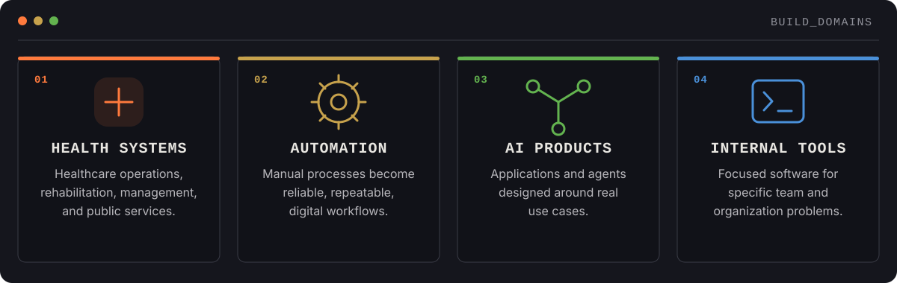
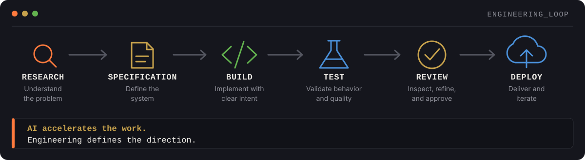
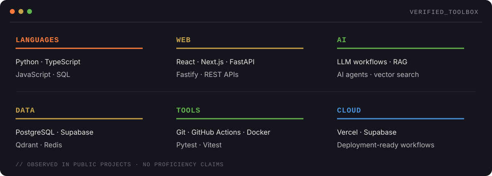

<!--
  GitHub profile README for Lailton Júnior.
  Visual assets are local, dependency-free SVGs designed for GitHub rendering.
-->

<picture>
  <source media="(max-width: 600px)" srcset="./assets/hero-mobile.svg" />
  
</picture>

## 01 / ABOUT

I build software that solves real operational problems.

My work sits at the intersection of software engineering, automation, artificial intelligence, and healthcare. I turn complex workflows into digital products that are clear, reliable, and useful in practice.

`Brazil` · `Open to building useful systems`

---

## 02 / WHAT I BUILD

<picture>
  <source media="(max-width: 600px)" srcset="./assets/pillars-mobile.svg" />
  
</picture>

---

## 03 / CURRENT FOCUS

<picture>
  <source media="(max-width: 600px)" srcset="./assets/terminal-mobile.svg" />
  
</picture>

---

## 04 / SELECTED WORK

<table>
  <tr>
    <td>
      <strong>PRONAS SYS SUITE</strong> 
      HEALTHCARE · AUTOMATION · AI
      
A multi-LLM assistant for structuring PRONAS/PCD healthcare projects, combining contextual generation with retrieval-backed knowledge.

      <code>Python</code> <code>FastAPI</code> <code>React</code> <code>TypeScript</code> <code>PostgreSQL</code> <code>Qdrant</code>  
      <a href="https://github.com/lailtonjunior/pronas-sys-suite-v2"><strong>VIEW PROJECT →</strong></a>
    </td>
  </tr>
</table>

<table>
  <tr>
    <td>
      <strong>FLOWCER4</strong> 
      HEALTHCARE · SCHEDULING · OPERATIONS
      
A multidisciplinary clinic scheduling system with administrative workflows, conflict validation, real-time views, and audit trails.

      <code>TypeScript</code> <code>Next.js</code> <code>React</code> <code>Supabase</code> <code>PostgreSQL</code>  
      <a href="https://github.com/lailtonjunior/flowcer4"><strong>VIEW PROJECT →</strong></a>
    </td>
  </tr>
</table>

<table>
  <tr>
    <td>
      <strong>FISCALZEN</strong> 
      FISCAL OPERATIONS · AUTOMATION · PLATFORM
      
A fiscal application for SEFAZ integrations, organized as a TypeScript monorepo with web, API, data, XML, and document packages.

      <code>TypeScript</code> <code>Next.js</code> <code>Fastify</code> <code>PostgreSQL</code> <code>Drizzle</code> <code>Docker</code>  
      <a href="https://github.com/lailtonjunior/fiscalzen-project"><strong>VIEW PROJECT →</strong></a>
    </td>
  </tr>
</table>

<table>
  <tr>
    <td>
      <strong>CLINIC AI / NEXUSCLIN</strong> 
      HEALTHCARE · CLINICAL OPERATIONS · SUS
      
A multiprofessional health record and clinic management system with SUS billing workflows for rehabilitation centers.

      <code>Python</code> <code>FastAPI</code> <code>Next.js</code> <code>PostgreSQL</code> <code>Redis</code> <code>Docker</code>  
      <a href="https://github.com/lailtonjunior/clinic_AI"><strong>VIEW PROJECT →</strong></a>
    </td>
  </tr>
</table>

---

## 05 / HOW I BUILD

<picture>
  <source media="(max-width: 600px)" srcset="./assets/process-mobile.svg" />
  
</picture>

---

## 06 / TOOLBOX

<picture>
  <source media="(max-width: 600px)" srcset="./assets/toolbox-mobile.svg" />
  
</picture>

---

## 07 / GITHUB ACTIVITY

One signal, kept intentionally simple. This contribution calendar is generated by the repository's existing GitHub Metrics workflow.

  

---

## 08 / CONNECT

**GITHUB** 
[github.com/lailtonjunior](https://github.com/lailtonjunior)

---

  

